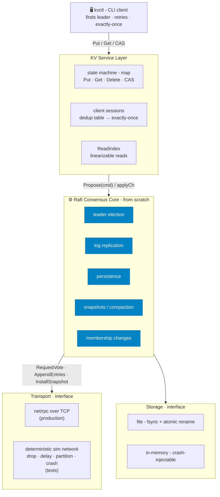

# 🗳️ raftkv - A Linearizable Distributed Key-Value Store

<div align="center">

[](https://go.dev/)
[](https://raft.github.io/raft.pdf)
[](https://go.dev/doc/articles/race_detector)
[](#-how-its-tested--the-whole-point)
[](https://github.com/Jenak26/raftkv/actions/workflows/ci.yml)
[](LICENSE)

[](https://codespaces.new/Jenak26/raftkv)

*Click **Open in Codespaces** to get a ready Go environment in your browser, then run `make chaos` to watch the linearizability suite pass under fault injection.*

</div>

**A fault-tolerant key-value store built on a from-scratch implementation of the [Raft consensus algorithm](https://raft.github.io/raft.pdf) - and tested the way real distributed databases are: inside a *deterministic simulation* where the network, clock, and disk are driven by a single seed.** No consensus libraries. No `hashicorp/raft`. The algorithm is built from the extended paper, function by function - election, replication, persistence, snapshotting, membership, and linearizable reads - and then put through a Jepsen-style gauntlet that *proves* it stays correct under partitions, crashes, and message loss.

> [!IMPORTANT]
> **The deliverable isn't "Raft works." It's "Raft is *provably* correct under chaos - and any failure replays from its seed."** A hand-written linearizability checker verifies that everything clients observed, while a nemesis tore the cluster apart, could only have come from a single correct machine. Three real, deep bugs were found, fixed, and written up as case files in the [**bug museum**](docs/bug-museum/).

---

## 🎬 Live demo

An interactive visualizer ([`cmd/raftviz`](cmd/raftviz)) runs a 5-node cluster in one process and serves a web UI: propose entries and watch them replicate, then **crash or isolate the leader and watch a new one get elected in real time.**

**▶️ Live:** _add your deployed URL here_ &nbsp;·&nbsp; or run it locally in one command:

```bash
go run ./cmd/raftviz      # then open http://localhost:7860
```

Deploy it as a single container (Render / Hugging Face / Fly) - see [`docs/DEPLOY.md`](docs/DEPLOY.md).

---

## 💡 Why I Built This

A from-scratch Raft KV store is, on its own, a commodity portfolio project - MIT's 6.5840 mints thousands a year. A senior engineer reading "I implemented Raft" thinks *"so did everyone - did you actually understand it, or did you brute-force the test suite?"*

So I set the bar somewhere harder. The core idea was simple: **make every source of non-determinism a knob I control.** Time, the network, and disk all sit behind interfaces. In production they're real (`net/rpc` over TCP, files with `fsync`). In tests they're a single seeded simulation that can drop, delay, reorder, and partition messages, and crash and restart nodes - all reproducibly. That one decision turns the two hardest things about distributed systems into tractable problems:

1. **You can *prove* correctness**, not just claim it - record what clients observed under fault injection and check the history for linearizability.
2. **You can *debug the undebuggable*** - a one-in-a-thousand race isn't a ghost, it's `make chaos SEED=42`.

Everything else in this repo follows from that.

---

## ⚡ Quickstart - drive a real 3-node cluster

> Requires Go 1.26+. Four terminals.

```bash
# Terminals 1–3 - a 3-node cluster, each node with its own durable data dir
PEERS="0=127.0.0.1:9000,1=127.0.0.1:9001,2=127.0.0.1:9002"
go run ./cmd/kvserver -id 0 -peers "$PEERS" -data ./data/0
go run ./cmd/kvserver -id 1 -peers "$PEERS" -data ./data/1
go run ./cmd/kvserver -id 2 -peers "$PEERS" -data ./data/2
```

```bash
# Terminal 4 - the CLI finds the leader, follows re-elections, and retries for you
SRV="127.0.0.1:9000,127.0.0.1:9001,127.0.0.1:9002"
go run ./cmd/kvctl -servers "$SRV" put color blue         # OK
go run ./cmd/kvctl -servers "$SRV" get color              # blue
go run ./cmd/kvctl -servers "$SRV" cas color blue green   # OK (swapped)
go run ./cmd/kvctl -servers "$SRV" del color              # OK (deleted)
```

> [!TIP]
> Kill the leader (`Ctrl-C`) mid-session. A new leader is elected within a couple hundred milliseconds, the CLI transparently retries, and your data is still there on restart - it was persisted with `fsync` + atomic rename.

A scripted version of this (boot a cluster, write, kill a node, keep serving) lives in [`docs/demo.tape`](docs/demo.tape). Render it to a GIF with [vhs](https://github.com/charmbracelet/vhs):

```bash
vhs docs/demo.tape   # writes docs/demo.gif
```

---

## 🏗️ Architecture

Every source of non-determinism sits behind an interface, so the **same Raft code** runs in production and inside the seeded simulation. That is the whole project in one diagram.



---

## 🧪 How It's Tested - *the whole point*

Correctness here is **proven, not asserted.** The test strategy *is* the project.

### 🎲 Deterministic Simulation Testing (DST)

The cluster runs in-process over a simulated network whose every fault - message drop, delay, reorder, partition, node crash/restart - is driven by one seeded RNG and an injected mock clock. A flaky distributed bug stops being a ghost and becomes a one-line repro.

### 🔬 Linearizability, verified under chaos

A seeded **nemesis** injects partitions and crashes while concurrent clients hammer the cluster. Every operation is recorded with its real-time bracket, and a **from-scratch [Wing-Gong-Lowe checker](test/linearizability/)** searches for a sequential ordering that explains what clients saw. If none exists, the run fails - and prints the seed.

> [!NOTE]
> **Why client retries don't corrupt the verdict.** Under chaos a write can time out at the transport yet still commit. Exactly-once client sessions (a per-client dedup table, updated *in the apply loop* so it's part of the replicated state) collapse retries, so every recorded operation maps to exactly one committed effect. The history is complete - so the checker's verdict is *sound*, not just suggestive.

### 🐛 The bug museum

Real bugs found while building this, each a case file - *symptom → which Raft invariant broke → fix → the test that now catches it*:

| # | Bug | Lesson |
|---|---|---|
| [01](docs/bug-museum/01-single-node-never-elects.md) | A single-node cluster never elected a leader | Evaluate a majority the instant the deciding vote is cast - including your own |
| [02](docs/bug-museum/02-internal-entries-delivered-to-app.md) | Raft delivered its own internal entries to the app, which panicked | Test the *integration* of features, not just each alone |
| [03](docs/bug-museum/03-harness-data-race.md) | The test harness raced under concurrent chaos | Caught by `-race` on the first concurrent run - infra is production code too |

### Run it yourself

```bash
make race            # every test under the race detector - the real gate
make chaos           # the nemesis + linearizability suite, sweeping seeds
make chaos SEED=42   # replay one seed, exactly
make bench           # latency / throughput benchmarks
make all             # gofmt + vet + race
```

---

## 📊 Results - the cost of consensus

Measured on a 3-node loopback cluster (`net/rpc`, in-memory persister) - full methodology in [`docs/BENCHMARKS.md`](docs/BENCHMARKS.md):

* 🛡️ **Linearizable read ≈ 143 µs** - ReadIndex confirms leadership with one heartbeat round, and writes *nothing* to the log.
* ⚡ **Stale read ≈ 71 µs** - served locally from any follower's state machine. ~2× faster, the consistency/latency knob made concrete.
* 🔁 **Write ≈ 1.2 ms** - a full consensus round: replicate to a majority, then apply.

> [!IMPORTANT]
> The ~2× linearizable-vs-stale gap and ~8× write cost aren't accidents - they're the trade-offs the design *exposes on purpose*, so you can choose per read. Optimizations (batching, pipelining, leader leases) are scoped as future work and **gated on re-passing the chaos suite** - an optimization that breaks linearizability is not an optimization.

---

## 🧩 What's Implemented - Raft, from the paper

| | Feature | Detail |
|---|---|---|
| ✅ | **Leader election** | terms as a logical clock, randomized timeouts, Election Safety verified across thousands of seeded partition runs |
| ✅ | **Log replication** | `AppendEntries` with the Log Matching property, conflict-term fast backtracking, and the Figure-8 current-term commit rule |
| ✅ | **Persistence & crash recovery** | `currentTerm`/`votedFor`/`log` durable *before* any reply; crash-atomic `fsync` + rename storage |
| ✅ | **Snapshotting** | `InstallSnapshot`, a log offset, single-applier delivery that dodges the app↔Raft restore deadlock |
| ✅ | **Membership changes** | single-server reconfiguration; safe without joint consensus via overlapping majorities |
| ✅ | **Linearizable reads** | ReadIndex with an election no-op + heartbeat confirmation; plus a fast stale-read mode |
| ✅ | **Exactly-once semantics** | client sessions + dedup table turn at-least-once delivery into exactly-once |
| ⬜ | **Stretch** | sharding, BoltDB storage, gRPC + TLS, Pre-Vote, Grafana dashboards - see [`plan.md`](plan.md) |

---

## 🛠️ Design Decisions

ADR-style - the *why* matters more than the *what*:

| Decision | Choice | Why |
|---|---|---|
| **Concurrency model** | one mutex per node; never held across an RPC | beginners' Raft dies to fine-grained locking; this kills the classic deadlock by rule |
| **Transport** | interface + `net/rpc` (prod) and a sim network (tests) | the simulated network is what makes deterministic fault injection - and this whole repo - possible |
| **Reads** | ReadIndex, not leader leases | no clock-skew assumption; correctness before the lease optimization |
| **Membership** | single-server changes, not joint consensus | old/new majorities always overlap, so split-brain is impossible without the heavier machinery |
| **Storage** | `Persister` interface; file with `fsync`+rename | clean boundary; a crash mid-write leaves the old or new bytes, never a torn file |

---

## 📚 Deep Dives

- [**Architecture**](docs/ARCHITECTURE.md) - the layers, the concurrency model (one mutex, never held across an RPC), the write/read paths, and the five Raft safety properties.
- [**Benchmarks**](docs/BENCHMARKS.md) - the cost of consensus and the read-consistency trade-off, with methodology.
- [🐛 **The bug museum**](docs/bug-museum/) - real bugs found while building this, each a case file: symptom → which invariant broke → fix → the test that catches it.

The consensus core in [`internal/raft`](internal/raft) is commented function-by-function against the Raft paper. See [`plan.md`](plan.md) for the full build plan.

---

## 🗺️ Repository Layout

```
cmd/            kvserver (a node) · kvctl (the CLI client)
internal/
  raft/         the consensus core - from scratch
  kv/           key-value state machine, server, client (Clerk)
  transport/    Transport interface + memnet (deterministic sim network)
  netrpc/       production net/rpc transport (node-to-node + client)
  storage/      Persister interface - file (fsync) + in-memory impls
  clock/        injectable time (real + deterministic mock)
test/
  cluster/      in-process N-node cluster harness
  chaos/        seeded nemesis + Jepsen-style verification
  linearizability/  from-scratch WGL linearizability checker
bench/          benchmark harness
docs/           architecture · benchmarks · the bug museum
```

---

## 📜 License

Released under the [MIT License](LICENSE).
